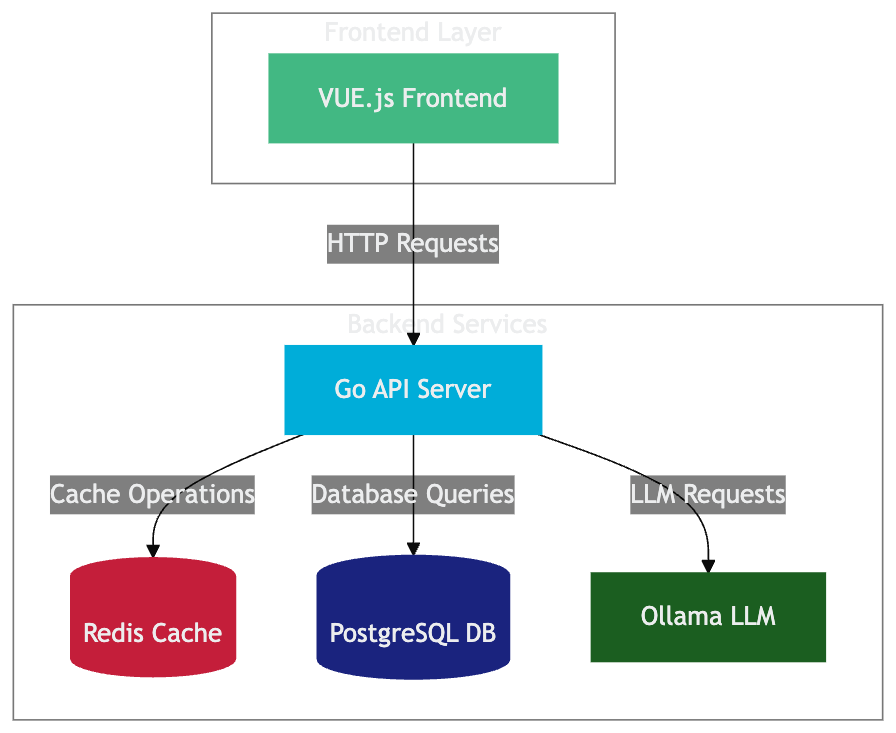

# Perfumer

**Perfumer** is a versatile and customizable platform designed to empower users to create their own unique perfumes. Whether you're a hobbyist or a professional, Perfumer offers intuitive tools and features to design fragrances tailored to your preferences.

## Key Features

- Fully customizable perfume creation experience
- User-friendly interface for blending and adjusting scent notes
- Support for a wide range of fragrance ingredients and accords

## Services

1. [Go API](./go-api/Dockerfile)
2. [Vue Frontend](./frontend/Dockerfile)
3. [LLM](./llm/Dockerfile)
4. PostgreSQL Database
5. Redis Cache

